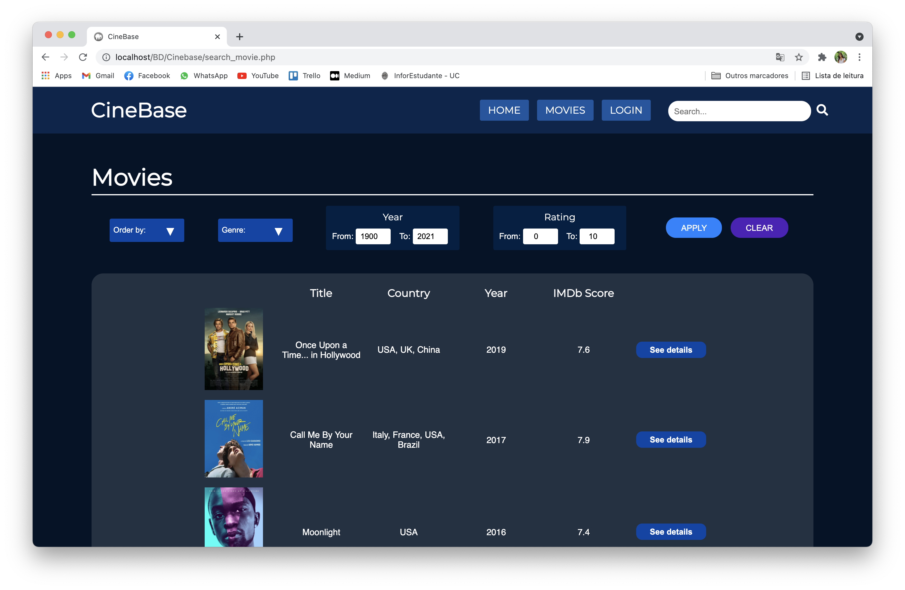
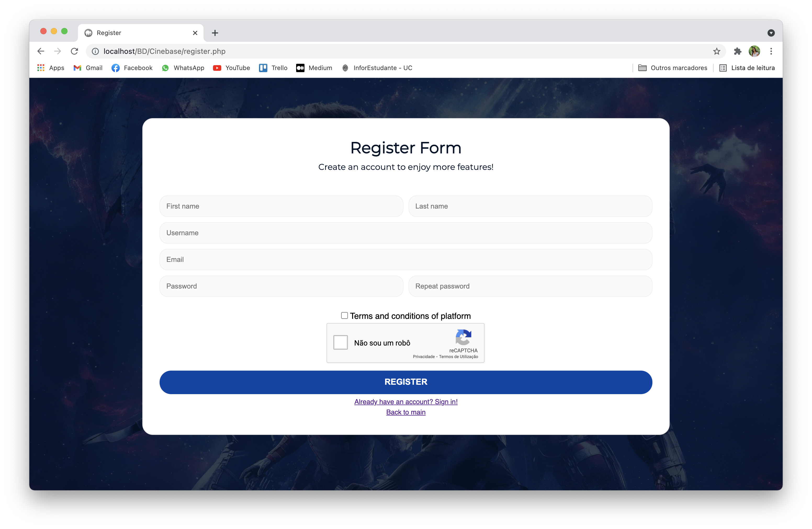
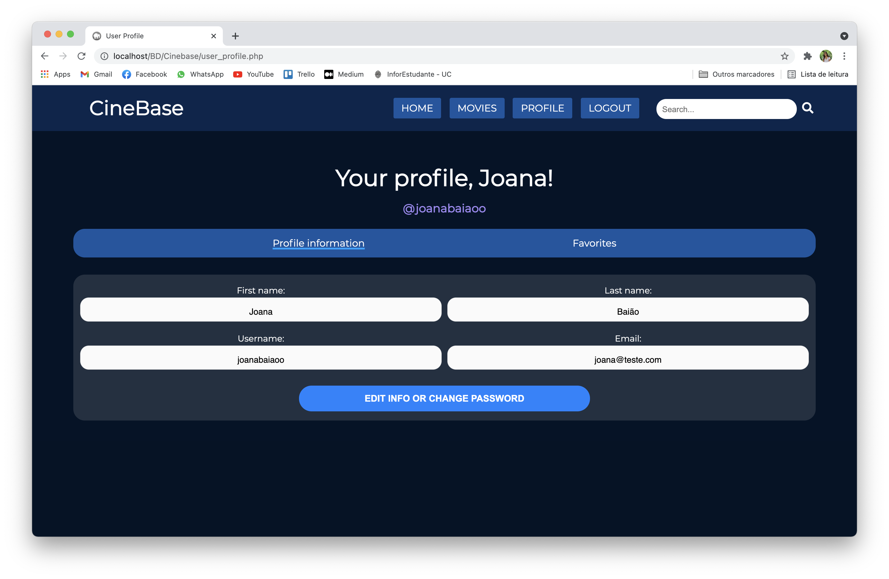
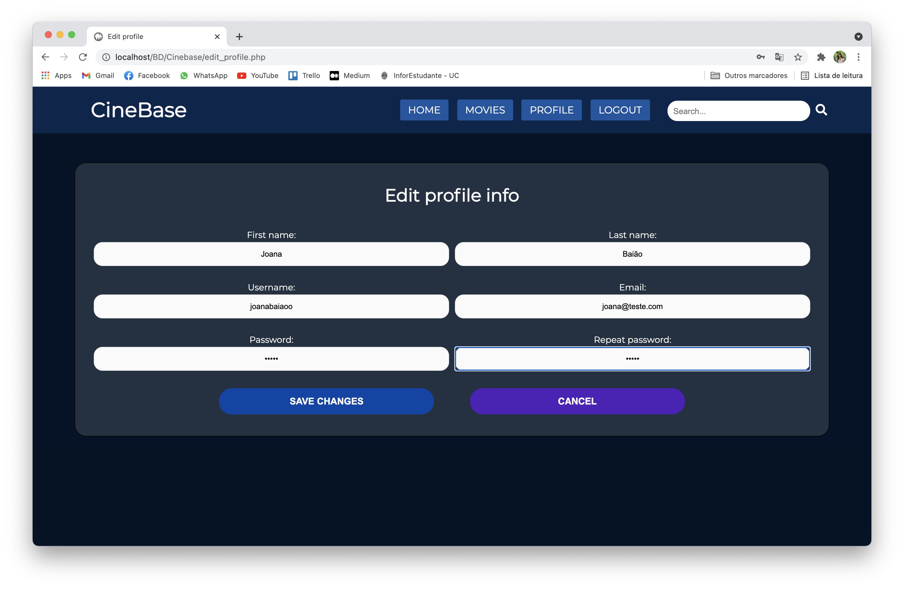
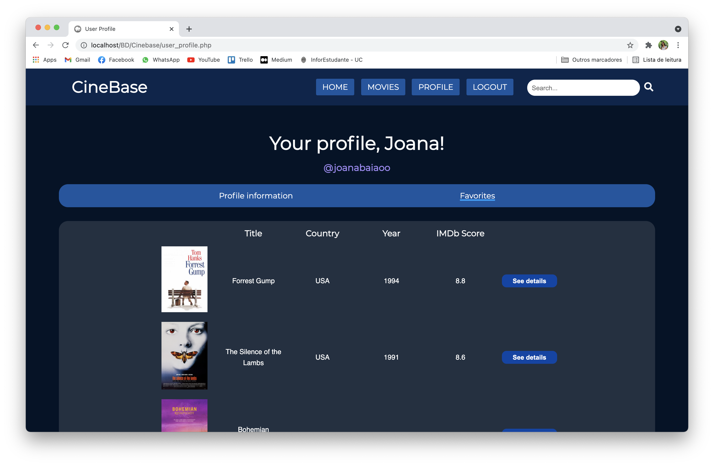
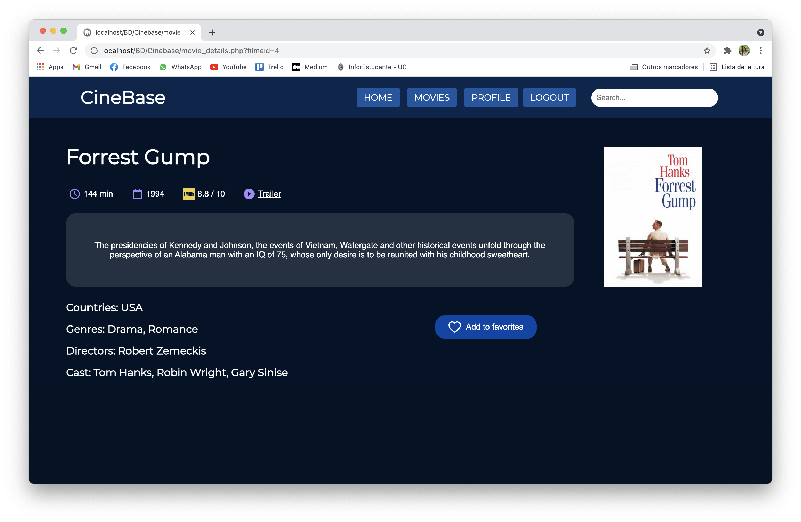

# BD - Cinebase 

Development of a movie website using PHP and MySQL, for the Databases and Information Analysis class.

## Features
- **All:** search movies; order and filter the results; login and registration
- **Logged user:** edit profile info and login credentials; add movies to favorites list; remove movie from favorites
- **Admin:** edit login credentials; manage users; add, edit and hide movies

## Instructions
- create a database named "cinebase" and import the file “cinebase.sql” to the PHP server
- move the folder cinebase to the path /MAMP/htdocs/

## Example
  
  
  
  

